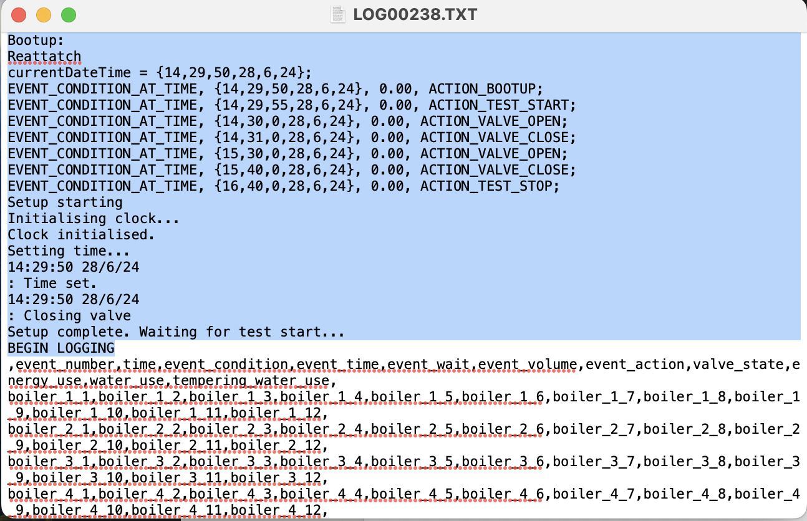

# Plentify_TestRig_DataViewer
 A simple python script to view the data from the control Arduino in graphs.
 This was through together super quickly mostly just to check which sensors where returning sensible values. 
 
 It is a bit clunky to use. Additionally, the textfile that the arduino outputs isn't in an easy-to-use format.

 ## Setup

1. Make sure you have installed MatplotLib, Pandas and Python3. 

2. Open the DataViewer.py file. 

3. Navigate to line 5 where the textfile is read into a dataframe and ensure that the name and path match the textfile you want to open. 

4. Open the textfile and delete all of the rows including and above the BEGIN LOGGING line. 
Note: I think the code for the Arduino should be changed not to include all of these lines in the text file, it makes it a mission to open and load the data into useable forms. I tried playing around with skiprows, but the number of rows changes depending on how many events you have and the file would get loaded as only having one column. 

5. Then just run the program and you can view graphs of each sensor. 
